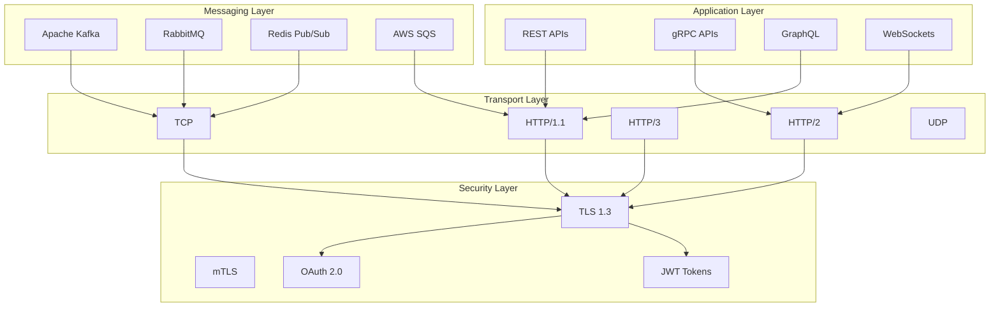

# Communication Protocols

The Xether AI platform uses a variety of communication protocols and patterns to ensure reliable, scalable, and efficient service-to-service communication. This document covers the protocols, message formats, and communication patterns used throughout the system.

## Protocol Overview

### Protocol Hierarchy



## REST APIs

### API Design Principles

**Resource-Oriented Design**
- Nouns, not verbs (e.g., `/datasets` not `/getDatasets`)
- Consistent URL patterns
- HTTP status codes for responses
- HATEOAS for navigation

**Versioning Strategy**
- URL versioning: `/v1/datasets`
- Backward compatibility
- Deprecation notices
- Migration guides

### API Structure

```yaml
# OpenAPI 3.0 specification
openapi: 3.0.3
info:
  title: Xether AI API
  version: 2.1.0
  description: REST API for Xether AI platform
servers:
  - url: https://api.xether.ai/v2
    description: Production server
  - url: https://api-dev.xether.ai/v2
    description: Development server

paths:
  /datasets:
    get:
      summary: List datasets
      parameters:
        - name: page
          in: query
          schema:
            type: integer
            default: 1
        - name: limit
          in: query
          schema:
            type: integer
            default: 20
      responses:
        '200':
          description: List of datasets
          content:
            application/json:
              schema:
                type: object
                properties:
                  data:
                    type: array
                    items:
                      $ref: '#/components/schemas/Dataset'
                  pagination:
                    $ref: '#/components/schemas/Pagination'
    
    post:
      summary: Create dataset
      requestBody:
        required: true
        content:
          application/json:
            schema:
              $ref: '#/components/schemas/CreateDatasetRequest'
      responses:
        '201':
          description: Dataset created
          content:
            application/json:
              schema:
                $ref: '#/components/schemas/Dataset'

  /datasets/{datasetId}:
    get:
      summary: Get dataset
      parameters:
        - name: datasetId
          in: path
          required: true
          schema:
            type: string
      responses:
        '200':
          description: Dataset details
          content:
            application/json:
              schema:
                $ref: '#/components/schemas/Dataset'
        '404':
          description: Dataset not found
```

### Implementation Example

```go
// REST API handler implementation
type DatasetHandler struct {
    service DatasetService
    logger  Logger
}

func (h *DatasetHandler) ListDatasets(c echo.Context) error {
    // Parse query parameters
    page, _ := strconv.Atoi(c.QueryParam("page"))
    if page < 1 {
        page = 1
    }
    
    limit, _ := strconv.Atoi(c.QueryParam("limit"))
    if limit < 1 || limit > 100 {
        limit = 20
    }
    
    // Build filters
    filters := &DatasetFilters{
        Tag:    c.QueryParam("tag"),
        Status: c.QueryParam("status"),
        Search: c.QueryParam("search"),
    }
    
    // Get datasets
    result, err := h.service.ListDatasets(c.Request().Context(), &ListDatasetsRequest{
        Page:   page,
        Limit:  limit,
        Filters: filters,
    })
    if err != nil {
        return echo.NewHTTPError(http.StatusInternalServerError, err.Error())
    }
    
    // Return response
    return c.JSON(http.StatusOK, map[string]interface{}{
        "data":       result.Datasets,
        "pagination": result.Pagination,
    })
}

func (h *DatasetHandler) CreateDataset(c echo.Context) error {
    // Parse request body
    var req CreateDatasetRequest
    if err := c.Bind(&req); err != nil {
        return echo.NewHTTPError(http.StatusBadRequest, "Invalid request body")
    }
    
    // Validate request
    if err := h.validateCreateRequest(&req); err != nil {
        return echo.NewHTTPError(http.StatusBadRequest, err.Error())
    }
    
    // Create dataset
    dataset, err := h.service.CreateDataset(c.Request().Context(), &req)
    if err != nil {
        return echo.NewHTTPError(http.StatusInternalServerError, err.Error())
    }
    
    return c.JSON(http.StatusCreated, dataset)
}
```

## gRPC APIs

### gRPC Service Definition

```protobuf
// syntax = "proto3";

package xether.ai.v1;

import "google/protobuf/timestamp.proto";
import "google/protobuf/empty.proto";

service DatasetService {
  rpc ListDatasets(ListDatasetsRequest) returns (ListDatasetsResponse);
  rpc GetDataset(GetDatasetRequest) returns (Dataset);
  rpc CreateDataset(CreateDatasetRequest) returns (Dataset);
  rpc UpdateDataset(UpdateDatasetRequest) returns (Dataset);
  rpc DeleteDataset(DeleteDatasetRequest) returns (google.protobuf.Empty);
}

message Dataset {
  string id = 1;
  string name = 2;
  string description = 3;
  Schema schema = 4;
  repeated string tags = 5;
  map<string, string> metadata = 6;
  google.protobuf.Timestamp created_at = 7;
  google.protobuf.Timestamp updated_at = 8;
  string created_by = 9;
  int32 version = 10;
  DatasetStatus status = 11;
}

message Schema {
  string type = 1;
  repeated Field fields = 2;
}

message Field {
  string name = 1;
  string type = 2;
  bool nullable = 3;
  oneof default_value {
    string string_value = 4;
    int64 int_value = 5;
    double double_value = 6;
    bool bool_value = 7;
  }
  string description = 8;
}

enum DatasetStatus {
  DATASET_STATUS_UNSPECIFIED = 0;
  DATASET_STATUS_ACTIVE = 1;
  DATASET_STATUS_ARCHIVED = 2;
  DATASET_STATUS_DELETED = 3;
}

message ListDatasetsRequest {
  int32 page = 1;
  int32 limit = 2;
  string tag = 3;
  string status = 4;
  string search = 5;
}

message ListDatasetsResponse {
  repeated Dataset datasets = 1;
  Pagination pagination = 2;
}

message Pagination {
  int32 page = 1;
  int32 limit = 2;
  int32 total = 3;
  int32 pages = 4;
}
```

### gRPC Server Implementation

```go
type gRPCDatasetServer struct {
    service DatasetService
    logger  Logger
    pb.UnimplementedDatasetServiceServer
}

func (s *gRPCDatasetServer) ListDatasets(ctx context.Context, req *pb.ListDatasetsRequest) (*pb.ListDatasetsResponse, error) {
    // Convert protobuf request to internal request
    internalReq := &ListDatasetsRequest{
        Page:   int(req.Page),
        Limit:  int(req.Limit),
        Filters: &DatasetFilters{
            Tag:    req.Tag,
            Status: req.Status,
            Search: req.Search,
        },
    }
    
    // Call service
    result, err := s.service.ListDatasets(ctx, internalReq)
    if err != nil {
        return nil, status.Error(codes.Internal, err.Error())
    }
    
    // Convert internal response to protobuf
    datasets := make([]*pb.Dataset, len(result.Datasets))
    for i, dataset := range result.Datasets {
        datasets[i] = s.convertDatasetToProtobuf(dataset)
    }
    
    return &pb.ListDatasetsResponse{
        Datasets:   datasets,
        Pagination: s.convertPaginationToProtobuf(result.Pagination),
    }, nil
}

func (s *gRPCDatasetServer) CreateDataset(ctx context.Context, req *pb.CreateDatasetRequest) (*pb.Dataset, error) {
    // Convert protobuf request to internal request
    internalReq := &CreateDatasetRequest{
        Name:        req.Name,
        Description: req.Description,
        Schema:      s.convertSchemaFromProtobuf(req.Schema),
        Tags:        req.Tags,
        Metadata:    req.Metadata,
    }
    
    // Call service
    dataset, err := s.service.CreateDataset(ctx, internalReq)
    if err != nil {
        return nil, status.Error(codes.Internal, err.Error())
    }
    
    return s.convertDatasetToProtobuf(dataset), nil
}

func (s *gRPCDatasetServer) convertDatasetToProtobuf(dataset *Dataset) *pb.Dataset {
    return &pb.Dataset{
        Id:          dataset.ID,
        Name:        dataset.Name,
        Description: dataset.Description,
        Schema:      s.convertSchemaToProtobuf(dataset.Schema),
        Tags:        dataset.Tags,
        Metadata:    dataset.Metadata,
        CreatedAt:   timestamppb.New(dataset.CreatedAt),
        UpdatedAt:   timestamppb.New(dataset.UpdatedAt),
        CreatedBy:   dataset.CreatedBy,
        Version:     int32(dataset.Version),
        Status:      pb.DatasetStatus(dataset.Status),
    }
}
```

## Message Queuing

### Kafka Integration

**Topic Structure**
```yaml
# Kafka topics configuration
topics:
  - name: pipeline-executions
    partitions: 10
    replication_factor: 3
    retention_ms: 604800000  # 7 days
    
  - name: dataset-updates
    partitions: 5
    replication_factor: 3
    retention_ms: 2592000000  # 30 days
    
  - name: ml-model-events
    partitions: 8
    replication_factor: 3
    retention_ms: 1209600000  # 14 days
```

**Message Schema**
```json
{
  "$schema": "http://json-schema.org/draft-07/schema#",
  "type": "object",
  "properties": {
    "event_id": {
      "type": "string",
      "format": "uuid"
    },
    "event_type": {
      "type": "string",
      "enum": ["pipeline.started", "pipeline.completed", "pipeline.failed"]
    },
    "event_version": {
      "type": "string",
      "pattern": "^\\d+\\.\\d+\\.\\d+$"
    },
    "timestamp": {
      "type": "string",
      "format": "date-time"
    },
    "source": {
      "type": "string",
      "description": "Service that generated the event"
    },
    "data": {
      "type": "object",
      "properties": {
        "pipeline_id": {
          "type": "string"
        },
        "execution_id": {
          "type": "string"
        },
        "status": {
          "type": "string",
          "enum": ["running", "completed", "failed"]
        },
        "metadata": {
          "type": "object",
          "additionalProperties": true
        }
      },
      "required": ["pipeline_id", "execution_id", "status"]
    }
  },
  "required": ["event_id", "event_type", "event_version", "timestamp", "source", "data"]
}
```

**Producer Implementation**
```go
type KafkaEventProducer struct {
    producer   kafka.Producer
    serializer EventSerializer
    topic      string
}

func (p *KafkaEventProducer) PublishEvent(ctx context.Context, event *Event) error {
    // Serialize event
    message, err := p.serializer.Serialize(event)
    if err != nil {
        return fmt.Errorf("failed to serialize event: %w", err)
    }
    
    // Create Kafka message
    kafkaMessage := &kafka.Message{
        TopicPartition: kafka.TopicPartition{
            Topic: &p.topic,
            Partition: kafka.PartitionAny,
        },
        Key:   []byte(event.AggregateID),
        Value: message,
        Headers: []kafka.Header{
            {Key: "event_type", Value: []byte(event.Type)},
            {Key: "event_version", Value: []byte(event.Version)},
            {Key: "source", Value: []byte(event.Source)},
        },
        Timestamp: event.Timestamp,
    }
    
    // Produce message
    return p.producer.Produce(kafkaMessage, nil)
}

func (p *KafkaEventProducer) PublishEventAsync(ctx context.Context, event *Event) chan error {
    errChan := make(chan error, 1)
    
    go func() {
        defer close(errChan)
        errChan <- p.PublishEvent(ctx, event)
    }()
    
    return errChan
}
```

**Consumer Implementation**
```go
type KafkaEventConsumer struct {
    consumer   kafka.Consumer
    handler    EventHandler
    serializer EventSerializer
}

func (c *KafkaEventConsumer) Start(ctx context.Context) error {
    // Subscribe to topics
    if err := c.consumer.SubscribeTopics([]string{"pipeline-executions", "dataset-updates"}, nil); err != nil {
        return fmt.Errorf("failed to subscribe to topics: %w", err)
    }
    
    // Start consumption loop
    for {
        select {
        case <-ctx.Done():
            return ctx.Err()
        default:
            msg, err := c.consumer.ReadMessage(100 * time.Millisecond)
            if err != nil {
                if err.(kafka.Error).Code() == kafka.ErrTimedOut {
                    continue
                }
                return fmt.Errorf("failed to read message: %w", err)
            }
            
            // Process message
            if err := c.processMessage(ctx, msg); err != nil {
                c.logger.Error("Failed to process message", "error", err)
                // Continue processing other messages
            }
        }
    }
}

func (c *KafkaEventConsumer) processMessage(ctx context.Context, msg *kafka.Message) error {
    // Deserialize event
    event, err := c.serializer.Deserialize(msg.Value)
    if err != nil {
        return fmt.Errorf("failed to deserialize event: %w", err)
    }
    
    // Validate event
    if err := c.validateEvent(event); err != nil {
        return fmt.Errorf("invalid event: %w", err)
    }
    
    // Handle event
    return c.handler.HandleEvent(ctx, event)
}
```

## WebSocket Communication

### WebSocket API Design

**Connection Management**
```go
type WebSocketManager struct {
    connections map[string]*WebSocketConnection
    hub         *Hub
    auth        AuthMiddleware
    logger      Logger
}

type WebSocketConnection struct {
    conn       *websocket.Conn
    userID     string
    sessionID  string
    send       chan []byte
    closeOnce  sync.Once
}

type Hub struct {
    clients    map[*WebSocketConnection]bool
    broadcast  chan []byte
    register   chan *WebSocketConnection
    unregister chan *WebSocketConnection
}

func (h *Hub) run() {
    for {
        select {
        case client := <-h.register:
            h.clients[client] = true
            
        case client := <-h.unregister:
            if _, ok := h.clients[client]; ok {
                delete(h.clients, client)
                close(client.send)
            }
            
        case message := <-h.broadcast:
            for client := range h.clients {
                select {
                case client.send <- message:
                default:
                    close(client.send)
                    delete(h.clients, client)
                }
            }
        }
    }
}
```

**Message Protocol**
```json
{
  "type": "message",
  "id": "msg_1234567890",
  "timestamp": "2024-01-15T10:30:00Z",
  "channel": "pipeline-executions",
  "data": {
    "execution_id": "exec_1234567890",
    "status": "running",
    "progress": 45,
    "stage": "data-processing"
  }
}
```

**Message Handlers**
```go
type MessageHandler interface {
    HandleMessage(ctx context.Context, conn *WebSocketConnection, msg *WebSocketMessage) error
}

type ExecutionStatusHandler struct {
    executionService ExecutionService
}

func (h *ExecutionStatusHandler) HandleMessage(ctx context.Context, conn *WebSocketConnection, msg *WebSocketMessage) error {
    switch msg.Type {
    case "subscribe":
        return h.handleSubscribe(ctx, conn, msg)
    case "unsubscribe":
        return h.handleUnsubscribe(ctx, conn, msg)
    case "get_status":
        return h.handleGetStatus(ctx, conn, msg)
    default:
        return fmt.Errorf("unknown message type: %s", msg.Type)
    }
}

func (h *ExecutionStatusHandler) handleSubscribe(ctx context.Context, conn *WebSocketConnection, msg *WebSocketMessage) error {
    var req SubscribeRequest
    if err := json.Unmarshal(msg.Data, &req); err != nil {
        return fmt.Errorf("invalid subscribe request: %w", err)
    }
    
    // Validate permissions
    if !h.executionService.CanAccessExecution(ctx, conn.userID, req.ExecutionID) {
        return fmt.Errorf("access denied")
    }
    
    // Subscribe to execution updates
    return h.executionService.SubscribeToExecution(ctx, req.ExecutionID, conn)
}
```

## Service Mesh Communication

### Istio Configuration

**Service Mesh Rules**
```yaml
# Virtual service for routing
apiVersion: networking.istio.io/v1beta1
kind: VirtualService
metadata:
  name: pipeline-service
spec:
  hosts:
  - pipeline-service
  http:
  - match:
    - uri:
        prefix: "/v1/pipelines"
    route:
    - destination:
        host: pipeline-service
        subset: v1
      weight: 80
    - destination:
        host: pipeline-service
        subset: v2
      weight: 20
    fault:
      delay:
        percentage:
          value: 1
        fixedDelay: 5s
    retries:
      attempts: 3
      perTryTimeout: 2s
```

**Traffic Management**
```yaml
# Destination rule for subsets
apiVersion: networking.istio.io/v1beta1
kind: DestinationRule
metadata:
  name: pipeline-service
spec:
  host: pipeline-service
  trafficPolicy:
    connectionPool:
      tcp:
        maxConnections: 100
      http:
        http1MaxPendingRequests: 50
        maxRequestsPerConnection: 10
    loadBalancer:
      simple: LEAST_CONN
    circuitBreaker:
      consecutiveErrors: 3
      interval: 30s
      baseEjectionTime: 30s
  subsets:
  - name: v1
    labels:
      version: v1
  - name: v2
    labels:
      version: v2
```

## Security Protocols

### mTLS Configuration

**Certificate Management**
```go
type mTLSServer struct {
    certFile string
    keyFile  string
    caFile   string
}

func (s *mTLSServer) createTLSConfig() (*tls.Config, error) {
    // Load server certificate
    cert, err := tls.LoadX509KeyPair(s.certFile, s.keyFile)
    if err != nil {
        return nil, fmt.Errorf("failed to load server certificate: %w", err)
    }
    
    // Load CA certificate
    caCert, err := ioutil.ReadFile(s.caFile)
    if err != nil {
        return nil, fmt.Errorf("failed to read CA certificate: %w", err)
    }
    
    caCertPool := x509.NewCertPool()
    if !caCertPool.AppendCertsFromPEM(caCert) {
        return nil, fmt.Errorf("failed to append CA certificate")
    }
    
    // Create TLS config
    return &tls.Config{
        Certificates: []tls.Certificate{cert},
        ClientCAs:    caCertPool,
        ClientAuth:   tls.RequireAndVerifyClientCert,
        MinVersion:   tls.VersionTLS12,
        CipherSuites: []uint16{
            tls.TLS_ECDHE_RSA_WITH_AES_256_GCM_SHA384,
            tls.TLS_ECDHE_RSA_WITH_CHACHA20_POLY1305,
            tls.TLS_ECDHE_ECDSA_WITH_AES_256_GCM_SHA384,
        },
    }, nil
}
```

### JWT Authentication

**Token Validation**
```go
type JWTValidator struct {
    publicKey *rsa.PublicKey
    issuer    string
    audience  string
}

func (v *JWTValidator) ValidateToken(tokenString string) (*Claims, error) {
    // Parse token
    token, err := jwt.ParseWithClaims(tokenString, &Claims{}, func(token *jwt.Token) (interface{}, error) {
        if _, ok := token.Method.(*jwt.SigningMethodRSA); !ok {
            return nil, fmt.Errorf("unexpected signing method: %v", token.Header["alg"])
        }
        return v.publicKey, nil
    })
    
    if err != nil {
        return nil, fmt.Errorf("failed to parse token: %w", err)
    }
    
    // Validate claims
    claims, ok := token.Claims.(*Claims)
    if !ok || !token.Valid {
        return nil, fmt.Errorf("invalid token")
    }
    
    // Validate issuer and audience
    if claims.Issuer != v.issuer {
        return nil, fmt.Errorf("invalid issuer")
    }
    
    if !contains(claims.Audience, v.audience) {
        return nil, fmt.Errorf("invalid audience")
    }
    
    return claims, nil
}

type Claims struct {
    UserID      string   `json:"user_id"`
    Email       string   `json:"email"`
    Roles       []string `json:"roles"`
    Permissions []string `json:"permissions"`
    jwt.StandardClaims
}
```

## Performance Optimization

### Connection Pooling

```go
type ConnectionPool struct {
    pool    chan *grpc.ClientConn
    factory ConnectionFactory
    mu      sync.Mutex
    size    int
}

func NewConnectionPool(size int, factory ConnectionFactory) *ConnectionPool {
    pool := &ConnectionPool{
        pool:    make(chan *grpc.ClientConn, size),
        factory: factory,
        size:    size,
    }
    
    // Initialize pool
    for i := 0; i < size; i++ {
        conn, err := factory()
        if err != nil {
            log.Printf("Failed to create connection: %v", err)
            continue
        }
        pool.pool <- conn
    }
    
    return pool
}

func (p *ConnectionPool) Get() (*grpc.ClientConn, error) {
    select {
    case conn := <-p.pool:
        return conn, nil
    default:
        // Pool is empty, create new connection
        return p.factory()
    }
}

func (p *ConnectionPool) Put(conn *grpc.ClientConn) {
    select {
    case p.pool <- conn:
        // Connection returned to pool
    default:
        // Pool is full, close connection
        conn.Close()
    }
}
```

### Caching Strategy

```go
type CacheClient struct {
    redis    *redis.Client
    local    *sync.Map
    ttl      time.Duration
    localTTL time.Duration
}

func (c *CacheClient) Get(ctx context.Context, key string) (interface{}, error) {
    // Check local cache first
    if value, ok := c.local.Load(key); ok {
        if item, ok := value.(*CacheItem); ok && !item.IsExpired() {
            return item.Value, nil
        }
        c.local.Delete(key)
    }
    
    // Check Redis cache
    value, err := c.redis.Get(ctx, key).Result()
    if err == redis.Nil {
        return nil, ErrNotFound
    } else if err != nil {
        return nil, err
    }
    
    // Deserialize and cache locally
    var result interface{}
    if err := json.Unmarshal([]byte(value), &result); err != nil {
        return nil, err
    }
    
    c.local.Store(key, &CacheItem{
        Value:     result,
        ExpiresAt: time.Now().Add(c.localTTL),
    })
    
    return result, nil
}

func (c *CacheClient) Set(ctx context.Context, key string, value interface{}) error {
    // Serialize value
    data, err := json.Marshal(value)
    if err != nil {
        return err
    }
    
    // Set in Redis
    if err := c.redis.Set(ctx, key, data, c.ttl).Err(); err != nil {
        return err
    }
    
    // Set in local cache
    c.local.Store(key, &CacheItem{
        Value:     value,
        ExpiresAt: time.Now().Add(c.localTTL),
    })
    
    return nil
}
```

## Monitoring and Observability

### Distributed Tracing

```go
type TracingMiddleware struct {
    tracer opentracing.Tracer
}

func (tm *TracingMiddleware) WrapHandler(handler http.Handler) http.Handler {
    return http.HandlerFunc(func(w http.ResponseWriter, r *http.Request) {
        // Extract span context from headers
        spanCtx, err := tm.tracer.Extract(opentracing.HTTPHeaders, opentracing.HTTPHeadersCarrier(r.Header))
        if err != nil && err != opentracing.ErrSpanContextNotFound {
            log.Printf("Failed to extract span context: %v", err)
        }
        
        // Start new span
        span := tm.tracer.StartSpan(
            fmt.Sprintf("%s %s", r.Method, r.URL.Path),
            opentracing.ChildOf(spanCtx),
            opentracing.Tag{Key: "http.method", Value: r.Method},
            opentracing.Tag{Key: "http.url", Value: r.URL.String()},
            opentracing.Tag{Key: "component", Value: "http-server"},
        )
        defer span.Finish()
        
        // Inject span context into headers
        span.Tracer().Inject(
            span.Context(),
            opentracing.HTTPHeaders,
            opentracing.HTTPHeadersCarrier(r.Header),
        )
        
        // Continue with request handling
        handler.ServeHTTP(w, r)
    })
}
```

### Metrics Collection

```go
type MetricsCollector struct {
    requestCounter    prometheus.Counter
    requestDuration   prometheus.Histogram
    errorCounter      prometheus.Counter
    activeConnections prometheus.Gauge
}

func (mc *MetricsCollector) RecordRequest(method, endpoint string, statusCode int, duration time.Duration) {
    mc.requestCounter.WithLabelValues(method, endpoint, fmt.Sprintf("%d", statusCode)).Inc()
    mc.requestDuration.WithLabelValues(method, endpoint).Observe(duration.Seconds())
    
    if statusCode >= 400 {
        mc.errorCounter.WithLabelValues(method, endpoint, fmt.Sprintf("%d", statusCode)).Inc()
    }
}

func (mc *MetricsCollector) IncrementActiveConnections() {
    mc.activeConnections.Inc()
}

func (mc *MetricsCollector) DecrementActiveConnections() {
    mc.activeConnections.Dec()
}
```

This communication protocols documentation provides a comprehensive overview of how services communicate within the Xether AI platform, covering REST APIs, gRPC, message queuing, WebSockets, security protocols, and performance optimization techniques.
