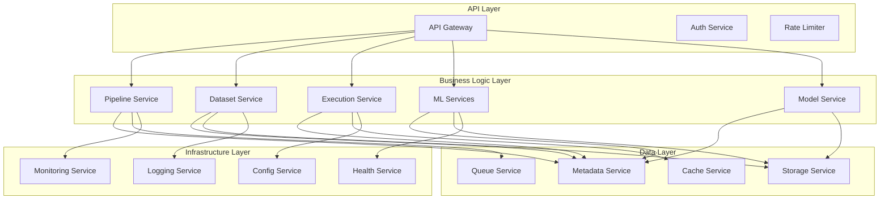
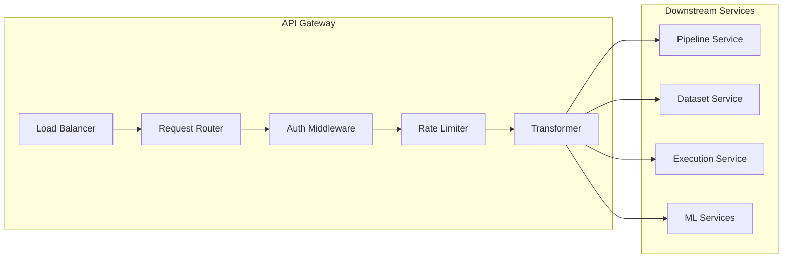
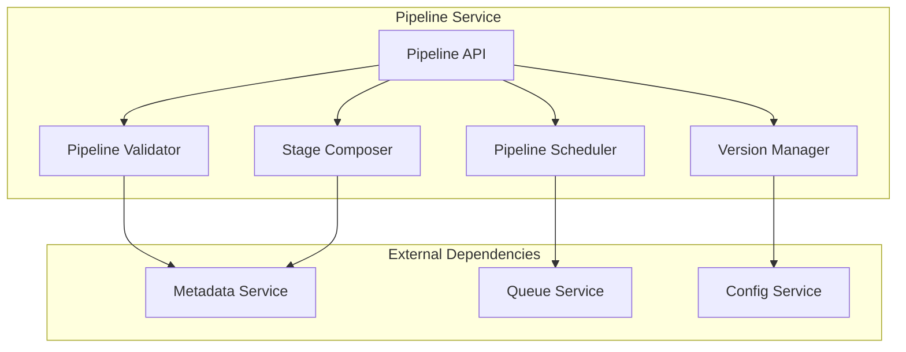
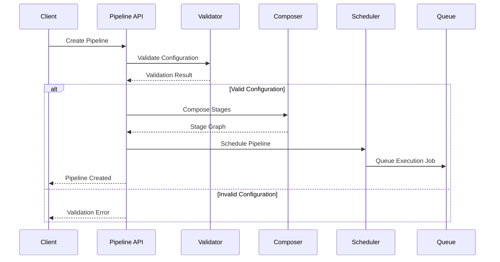
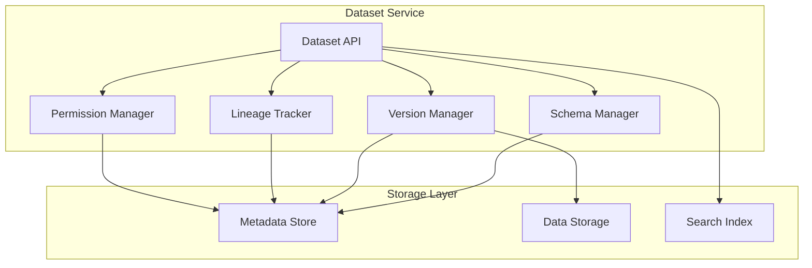
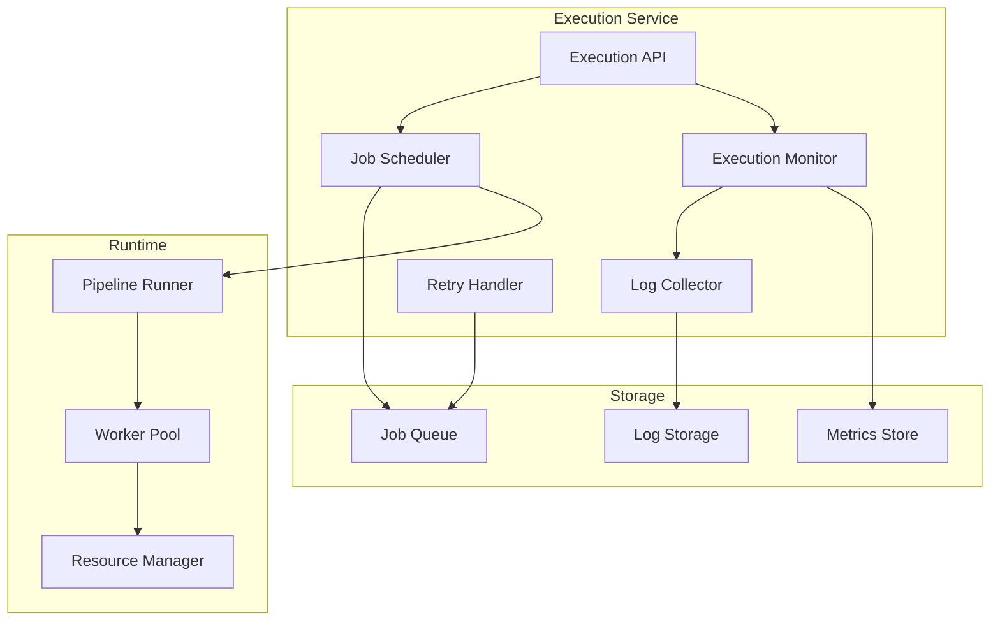
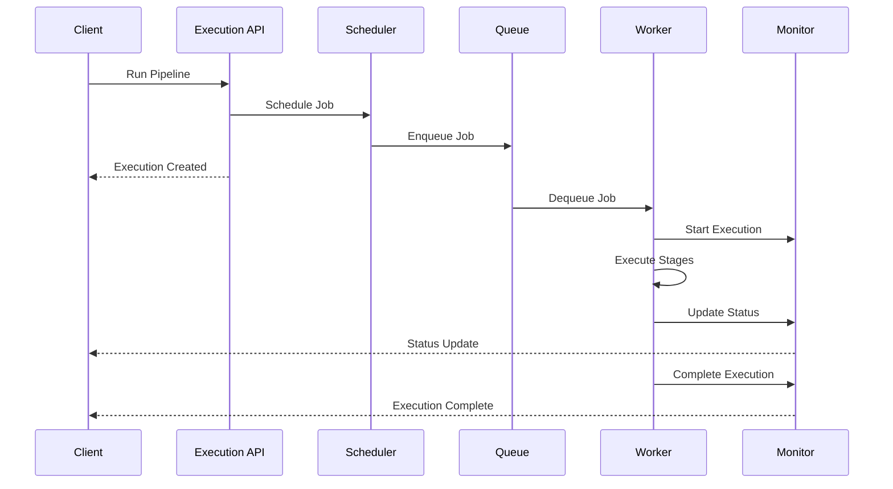
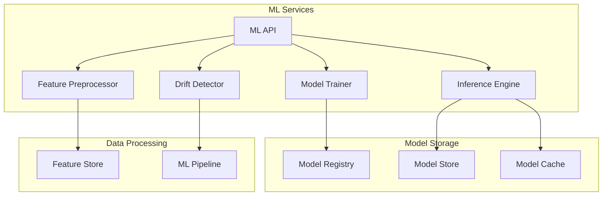
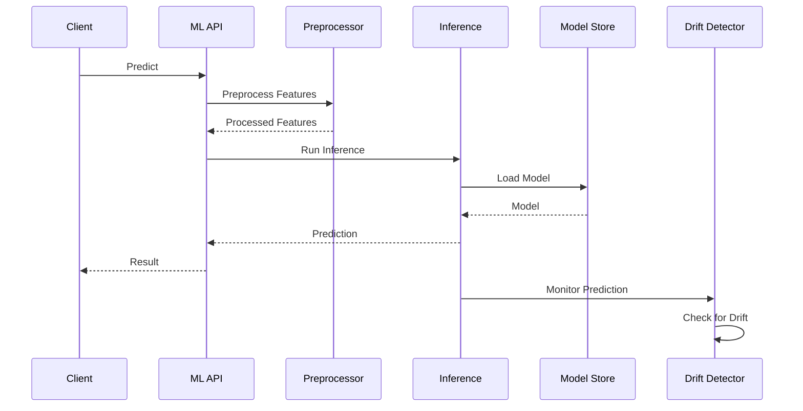

# Microservices

The Xether AI platform is built on a microservices architecture that enables scalability, resilience, and independent development cycles. Each service is designed to be autonomous, loosely coupled, and highly specialized.

## Service Architecture Overview

### Core Service Categories



## API Gateway Service

### Responsibilities
- Request routing and load balancing
- Authentication and authorization
- Rate limiting and quota management
- Request/response transformation
- API versioning and backward compatibility

### Architecture



### Configuration

```yaml
apiVersion: v1
kind: Deployment
metadata:
  name: api-gateway
spec:
  replicas: 3
  selector:
    matchLabels:
      app: api-gateway
  template:
    metadata:
      labels:
        app: api-gateway
    spec:
      containers:
      - name: gateway
        image: xether-ai/api-gateway:v2.1.0
        ports:
        - containerPort: 8080
        env:
        - name: AUTH_SERVICE_URL
          value: "http://auth-service:8080"
        - name: RATE_LIMIT_REDIS_URL
          value: "redis://cache-service:6379"
        resources:
          requests:
            memory: "256Mi"
            cpu: "250m"
          limits:
            memory: "512Mi"
            cpu: "500m"
```

### Implementation Details

**Request Routing**
```go
// Request routing logic
type RequestRouter struct {
    services map[string]ServiceEndpoint
    loadBalancer LoadBalancer
}

func (r *RequestRouter) RouteRequest(req *http.Request) (*ServiceEndpoint, error) {
    path := req.URL.Path
    method := req.Method
    
    // Determine target service based on path and method
    serviceKey := r.determineService(path, method)
    
    // Select healthy instance using load balancing
    endpoint, err := r.loadBalancer.SelectInstance(serviceKey)
    if err != nil {
        return nil, err
    }
    
    return endpoint, nil
}
```

**Rate Limiting**
```go
// Rate limiting implementation
type RateLimiter struct {
    redisClient *redis.Client
    limits map[string]RateLimit
}

func (rl *RateLimiter) CheckLimit(userID, endpoint string) (bool, error) {
    key := fmt.Sprintf("rate_limit:%s:%s", userID, endpoint)
    limit, exists := rl.limits[endpoint]
    if !exists {
        return true, nil
    }
    
    count, err := rl.redisClient.Incr(key).Result()
    if err != nil {
        return false, err
    }
    
    if count == 1 {
        rl.redisClient.Expire(key, time.Hour)
    }
    
    return count <= limit.Requests, nil
}
```

## Pipeline Service

### Responsibilities
- Pipeline definition and validation
- Stage composition and dependency resolution
- Pipeline scheduling and trigger management
- Pipeline versioning and lifecycle management

### Service Architecture



### Pipeline Processing Flow



### Implementation Details

**Pipeline Validation**
```go
type PipelineValidator struct {
    stageRegistry map[string]StageType
    schemaValidator SchemaValidator
}

func (pv *PipelineValidator) ValidatePipeline(pipeline *Pipeline) error {
    // Validate pipeline structure
    if err := pv.validateStructure(pipeline); err != nil {
        return err
    }
    
    // Validate each stage
    for _, stage := range pipeline.Stages {
        if err := pv.validateStage(stage); err != nil {
            return fmt.Errorf("stage %s: %w", stage.Name, err)
        }
    }
    
    // Validate dependencies
    if err := pv.validateDependencies(pipeline); err != nil {
        return err
    }
    
    return nil
}

func (pv *PipelineValidator) validateStage(stage *Stage) error {
    stageType, exists := pv.stageRegistry[stage.Type]
    if !exists {
        return fmt.Errorf("unknown stage type: %s", stage.Type)
    }
    
    return pv.schemaValidator.Validate(stage.Config, stageType.ConfigSchema)
}
```

**Stage Composition**
```go
type StageComposer struct {
    dependencyResolver DependencyResolver
}

func (sc *StageComposer) ComposeStages(stages []*Stage) (*StageGraph, error) {
    graph := NewStageGraph()
    
    // Add stages to graph
    for _, stage := range stages {
        graph.AddStage(stage)
    }
    
    // Resolve dependencies
    dependencies, err := sc.dependencyResolver.Resolve(stages)
    if err != nil {
        return nil, err
    }
    
    // Add edges to graph
    for _, dep := range dependencies {
        graph.AddDependency(dep.From, dep.To)
    }
    
    // Validate for cycles
    if graph.HasCycles() {
        return nil, fmt.Errorf("pipeline contains cyclic dependencies")
    }
    
    return graph, nil
}
```

## Dataset Service

### Responsibilities
- Dataset creation and schema management
- Dataset versioning and lineage tracking
- Access control and permissions
- Data discovery and search

### Service Architecture



### Data Model

```go
type Dataset struct {
    ID          string                 `json:"id"`
    Name        string                 `json:"name"`
    Description string                 `json:"description"`
    Schema      *Schema               `json:"schema"`
    Tags        []string               `json:"tags"`
    Metadata    map[string]interface{} `json:"metadata"`
    CreatedAt   time.Time              `json:"created_at"`
    UpdatedAt   time.Time              `json:"updated_at"`
    CreatedBy   string                 `json:"created_by"`
    Version     int                    `json:"version"`
    Status      DatasetStatus          `json:"status"`
}

type Schema struct {
    Type   string  `json:"type"`
    Fields []Field `json:"fields"`
}

type Field struct {
    Name     string `json:"name"`
    Type     string `json:"type"`
    Nullable bool   `json:"nullable"`
    Default  *interface{} `json:"default,omitempty"`
    Description string `json:"description,omitempty"`
}
```

### Implementation Details

**Schema Management**
```go
type SchemaManager struct {
    validator SchemaValidator
    registry  SchemaRegistry
}

func (sm *SchemaManager) ValidateSchema(schema *Schema) error {
    // Validate schema structure
    if err := sm.validateStructure(schema); err != nil {
        return err
    }
    
    // Validate field definitions
    for _, field := range schema.Fields {
        if err := sm.validateField(field); err != nil {
            return fmt.Errorf("field %s: %w", field.Name, err)
        }
    }
    
    return nil
}

func (sm *SchemaManager) EvolveSchema(oldSchema, newSchema *Schema) (*SchemaEvolution, error) {
    evolution := &SchemaEvolution{
        Type: EvolutionTypeCompatible,
        Changes: []SchemaChange{},
    }
    
    // Check for breaking changes
    if sm.hasBreakingChanges(oldSchema, newSchema) {
        evolution.Type = EvolutionTypeBreaking
    }
    
    // Calculate specific changes
    evolution.Changes = sm.calculateChanges(oldSchema, newSchema)
    
    return evolution, nil
}
```

**Version Management**
```go
type VersionManager struct {
    storage    VersionStorage
    lineage    LineageTracker
}

func (vm *VersionManager) CreateVersion(datasetID string, data interface{}) (*DatasetVersion, error) {
    // Generate version number
    version, err := vm.generateVersionNumber(datasetID)
    if err != nil {
        return nil, err
    }
    
    // Create version record
    datasetVersion := &DatasetVersion{
        DatasetID:    datasetID,
        Version:      version,
        Data:         data,
        CreatedAt:    time.Now(),
        Checksum:     vm.calculateChecksum(data),
        Size:         vm.calculateSize(data),
    }
    
    // Store version
    if err := vm.storage.Store(datasetVersion); err != nil {
        return nil, err
    }
    
    // Update lineage
    if err := vm.lineage.UpdateLineage(datasetID, version); err != nil {
        // Log error but don't fail the operation
        log.Printf("Failed to update lineage: %v", err)
    }
    
    return datasetVersion, nil
}
```

## Execution Service

### Responsibilities
- Job scheduling and resource allocation
- Execution monitoring and status tracking
- Log collection and aggregation
- Error handling and retry logic

### Service Architecture



### Execution Flow



### Implementation Details

**Job Scheduling**
```go
type JobScheduler struct {
    queue     JobQueue
    workers   WorkerPool
    resources ResourceManager
}

func (js *JobScheduler) ScheduleJob(job *Job) error {
    // Check resource availability
    if !js.resources.HasAvailableResources(job.ResourceRequirements) {
        return fmt.Errorf("insufficient resources")
    }
    
    // Calculate priority
    priority := js.calculatePriority(job)
    
    // Enqueue job
    return js.queue.Enqueue(job, priority)
}

func (js *JobScheduler) calculatePriority(job *Job) int {
    priority := 0
    
    // Base priority from job type
    switch job.Type {
    case JobTypeInteractive:
        priority += 100
    case JobTypeBatch:
        priority += 50
    case JobTypeBackground:
        priority += 10
    }
    
    // Add user priority
    priority += job.UserPriority
    
    // Add urgency factor
    if job.Urgent {
        priority += 200
    }
    
    return priority
}
```

**Execution Monitoring**
```go
type ExecutionMonitor struct {
    executions map[string]*Execution
    metrics    MetricsCollector
    notifier   Notifier
}

func (em *ExecutionMonitor) StartExecution(executionID string) error {
    execution := &Execution{
        ID:        executionID,
        Status:    StatusRunning,
        StartedAt: time.Now(),
    }
    
    em.executions[executionID] = execution
    
    // Start monitoring
    go em.monitorExecution(execution)
    
    // Notify start
    em.notifier.NotifyExecutionStarted(execution)
    
    return nil
}

func (em *ExecutionMonitor) monitorExecution(execution *Execution) {
    ticker := time.NewTicker(5 * time.Second)
    defer ticker.Stop()
    
    for {
        select {
        case <-ticker.C:
            if err := em.updateExecutionStatus(execution); err != nil {
                log.Printf("Failed to update execution status: %v", err)
            }
            
            // Check if execution is complete
            if execution.Status == StatusCompleted || execution.Status == StatusFailed {
                em.notifier.NotifyExecutionCompleted(execution)
                return
            }
            
        case <-execution.Context.Done():
            // Execution was cancelled
            execution.Status = StatusCancelled
            em.notifier.NotifyExecutionCancelled(execution)
            return
        }
    }
}
```

## ML Services

### Responsibilities
- Model training and inference
- Feature engineering and preprocessing
- Model versioning and deployment
- Performance monitoring and drift detection

### Service Architecture



### ML Pipeline Processing



### Implementation Details

**Model Training**
```go
type ModelTrainer struct {
    registry   ModelRegistry
    storage    ModelStorage
    monitor    TrainingMonitor
}

func (mt *ModelTrainer) TrainModel(config *TrainingConfig) (*Model, error) {
    // Create training job
    job := &TrainingJob{
        ID:        generateJobID(),
        Config:    config,
        Status:    StatusPending,
        CreatedAt: time.Now(),
    }
    
    // Start training
    go mt.executeTraining(job)
    
    return &Model{JobID: job.ID}, nil
}

func (mt *ModelTrainer) executeTraining(job *TrainingJob) {
    // Update status
    job.Status = StatusRunning
    mt.monitor.UpdateJob(job)
    
    // Load training data
    data, err := mt.loadTrainingData(job.Config.DatasetID)
    if err != nil {
        job.Status = StatusFailed
        job.Error = err.Error()
        mt.monitor.UpdateJob(job)
        return
    }
    
    // Train model
    model, err := mt.trainModel(data, job.Config)
    if err != nil {
        job.Status = StatusFailed
        job.Error = err.Error()
        mt.monitor.UpdateJob(job)
        return
    }
    
    // Save model
    if err := mt.storage.Store(model); err != nil {
        job.Status = StatusFailed
        job.Error = err.Error()
        mt.monitor.UpdateJob(job)
        return
    }
    
    // Register model
    if err := mt.registry.Register(model); err != nil {
        job.Status = StatusFailed
        job.Error = err.Error()
        mt.monitor.UpdateJob(job)
        return
    }
    
    // Update status
    job.Status = StatusCompleted
    job.ModelID = model.ID
    mt.monitor.UpdateJob(job)
}
```

**Inference Engine**
```go
type InferenceEngine struct {
    modelCache  ModelCache
    preprocessor FeaturePreprocessor
    monitor     InferenceMonitor
}

func (ie *InferenceEngine) Predict(modelID string, features map[string]interface{}) (*Prediction, error) {
    // Load model
    model, err := ie.modelCache.Get(modelID)
    if err != nil {
        return nil, err
    }
    
    // Preprocess features
    processedFeatures, err := ie.preprocessor.Process(features, model.PreprocessingConfig)
    if err != nil {
        return nil, err
    }
    
    // Run inference
    prediction, err := model.Predict(processedFeatures)
    if err != nil {
        return nil, err
    }
    
    // Log inference
    ie.monitor.LogInference(&InferenceLog{
        ModelID:    modelID,
        Features:   features,
        Prediction: prediction,
        Timestamp:  time.Now(),
    })
    
    return prediction, nil
}
```

## Service Communication

### Communication Patterns

**Synchronous Communication**
- REST APIs for external communication
- gRPC for high-performance internal communication
- Request-response pattern for immediate results

**Asynchronous Communication**
- Message queues for decoupled processing
- Event streaming for real-time updates
- Pub/sub pattern for broadcast notifications

### Service Discovery

```go
type ServiceRegistry struct {
    consul *consul.Client
    cache  map[string]*ServiceInfo
    mu     sync.RWMutex
}

func (sr *ServiceRegistry) RegisterService(service *ServiceInfo) error {
    // Register with Consul
    registration := &consul.AgentServiceRegistration{
        ID:      service.ID,
        Name:    service.Name,
        Address: service.Address,
        Port:    service.Port,
        Tags:    service.Tags,
        Check: &consul.AgentServiceCheck{
            HTTP:     fmt.Sprintf("http://%s:%d/health", service.Address, service.Port),
            Interval: "10s",
            Timeout:  "3s",
        },
    }
    
    if err := sr.consul.Agent().ServiceRegister(registration); err != nil {
        return err
    }
    
    // Update cache
    sr.mu.Lock()
    sr.cache[service.Name] = service
    sr.mu.Unlock()
    
    return nil
}

func (sr *ServiceRegistry) DiscoverService(serviceName string) (*ServiceInfo, error) {
    // Check cache first
    sr.mu.RLock()
    if service, exists := sr.cache[serviceName]; exists {
        sr.mu.RUnlock()
        return service, nil
    }
    sr.mu.RUnlock()
    
    // Query Consul
    services, _, err := sr.consul.Health().Service(serviceName, "", true, nil)
    if err != nil {
        return nil, err
    }
    
    if len(services) == 0 {
        return nil, fmt.Errorf("service %s not found", serviceName)
    }
    
    // Select healthy instance
    service := services[0]
    serviceInfo := &ServiceInfo{
        ID:      service.Service.ID,
        Name:    service.Service.Service,
        Address: service.Service.Address,
        Port:    service.Service.Port,
        Tags:    service.Service.Tags,
    }
    
    // Update cache
    sr.mu.Lock()
    sr.cache[serviceName] = serviceInfo
    sr.mu.Unlock()
    
    return serviceInfo, nil
}
```

## Service Configuration

### Configuration Management

```yaml
# service-config.yaml
services:
  api-gateway:
    replicas: 3
    resources:
      requests:
        memory: "256Mi"
        cpu: "250m"
      limits:
        memory: "512Mi"
        cpu: "500m"
    env:
      - name: LOG_LEVEL
        value: "info"
      - name: RATE_LIMIT_REQUESTS
        value: "1000"
  
  pipeline-service:
    replicas: 2
    resources:
      requests:
        memory: "512Mi"
        cpu: "500m"
      limits:
        memory: "1Gi"
        cpu: "1000m"
    env:
      - name: DATABASE_URL
        valueFrom:
          secretKeyRef:
            name: db-credentials
            key: url
  
  execution-service:
    replicas: 5
    resources:
      requests:
        memory: "1Gi"
        cpu: "1000m"
      limits:
        memory: "2Gi"
        cpu: "2000m"
    env:
      - name: WORKER_COUNT
        value: "10"
      - name: QUEUE_URL
        value: "redis://queue-service:6379"
```

### Deployment Templates

```yaml
# service-template.yaml
apiVersion: apps/v1
kind: Deployment
metadata:
  name: {{ .Values.serviceName }}
  labels:
    app: {{ .Values.serviceName }}
spec:
  replicas: {{ .Values.replicas }}
  selector:
    matchLabels:
      app: {{ .Values.serviceName }}
  template:
    metadata:
      labels:
        app: {{ .Values.serviceName }}
    spec:
      containers:
      - name: {{ .Values.serviceName }}
        image: {{ .Values.image }}:{{ .Values.version }}
        ports:
        - containerPort: {{ .Values.port }}
        env:
        {{- range .Values.env }}
        - name: {{ .name }}
          value: {{ .value | quote }}
        {{- end }}
        resources:
          requests:
            memory: {{ .Values.resources.requests.memory }}
            cpu: {{ .Values.resources.requests.cpu }}
          limits:
            memory: {{ .Values.resources.limits.memory }}
            cpu: {{ .Values.resources.limits.cpu }}
        livenessProbe:
          httpGet:
            path: /health
            port: {{ .Values.port }}
          initialDelaySeconds: 30
          periodSeconds: 10
        readinessProbe:
          httpGet:
            path: /ready
            port: {{ .Values.port }}
          initialDelaySeconds: 5
          periodSeconds: 5
```

## Monitoring and Observability

### Service Metrics

```go
type ServiceMetrics struct {
    requestCounter    prometheus.Counter
    requestDuration   prometheus.Histogram
    errorCounter      prometheus.Counter
    activeConnections prometheus.Gauge
}

func NewServiceMetrics(serviceName string) *ServiceMetrics {
    return &ServiceMetrics{
        requestCounter: prometheus.NewCounter(prometheus.CounterOpts{
            Name: fmt.Sprintf("%s_requests_total", serviceName),
            Help: fmt.Sprintf("Total number of requests for %s", serviceName),
        }),
        requestDuration: prometheus.NewHistogram(prometheus.HistogramOpts{
            Name:    fmt.Sprintf("%s_request_duration_seconds", serviceName),
            Help:    fmt.Sprintf("Request duration for %s", serviceName),
            Buckets: prometheus.DefBuckets,
        }),
        errorCounter: prometheus.NewCounter(prometheus.CounterOpts{
            Name: fmt.Sprintf("%s_errors_total", serviceName),
            Help: fmt.Sprintf("Total number of errors for %s", serviceName),
        }),
        activeConnections: prometheus.NewGauge(prometheus.GaugeOpts{
            Name: fmt.Sprintf("%s_active_connections", serviceName),
            Help: fmt.Sprintf("Number of active connections for %s", serviceName),
        }),
    }
}
```

### Health Checks

```go
type HealthChecker struct {
    checks map[string]HealthCheck
}

type HealthCheck interface {
    Name() string
    Check(ctx context.Context) error
}

type DatabaseHealthCheck struct {
    db *sql.DB
}

func (dhc *DatabaseHealthCheck) Name() string {
    return "database"
}

func (dhc *DatabaseHealthCheck) Check(ctx context.Context) error {
    return dhc.db.PingContext(ctx)
}

type RedisHealthCheck struct {
    client *redis.Client
}

func (rhc *RedisHealthCheck) Name() string {
    return "redis"
}

func (rhc *RedisHealthCheck) Check(ctx context.Context) error {
    return rhc.client.Ping(ctx).Err()
}

func (hc *HealthChecker) CheckHealth(ctx context.Context) map[string]string {
    results := make(map[string]string)
    
    for name, check := range hc.checks {
        if err := check.Check(ctx); err != nil {
            results[name] = fmt.Sprintf("unhealthy: %v", err)
        } else {
            results[name] = "healthy"
        }
    }
    
    return results
}
```

This microservices architecture documentation provides a comprehensive overview of how the Xether AI platform is structured, with detailed implementation examples and operational considerations for each service.
