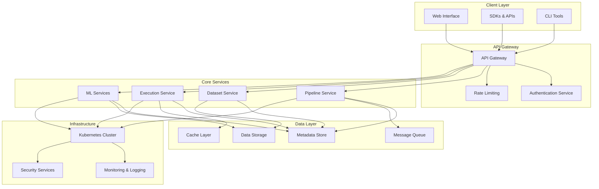
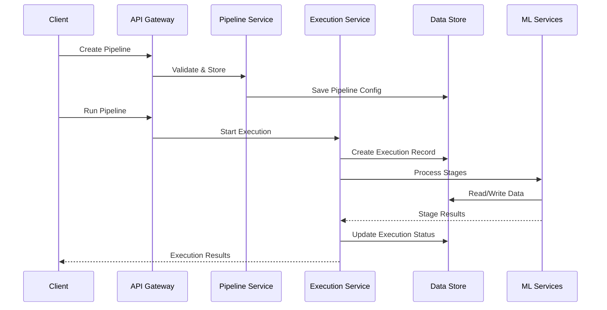
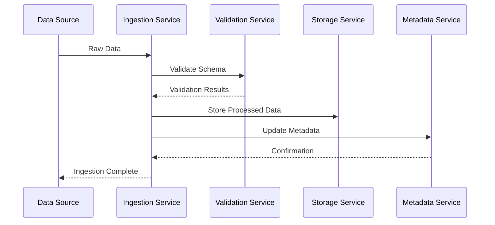
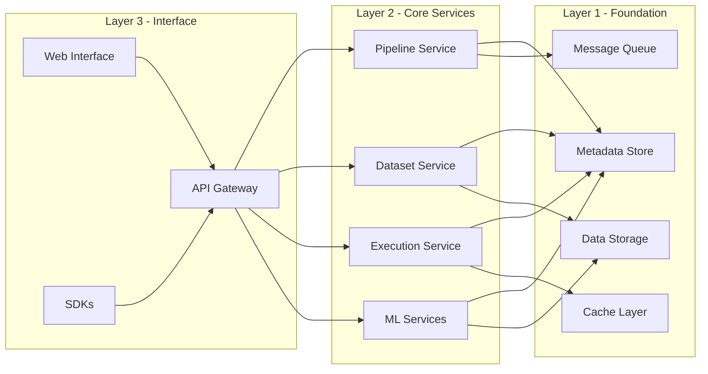
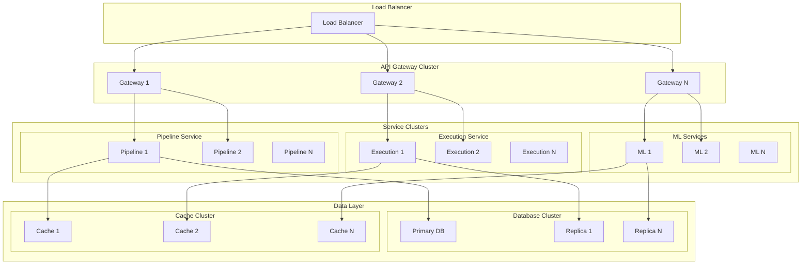
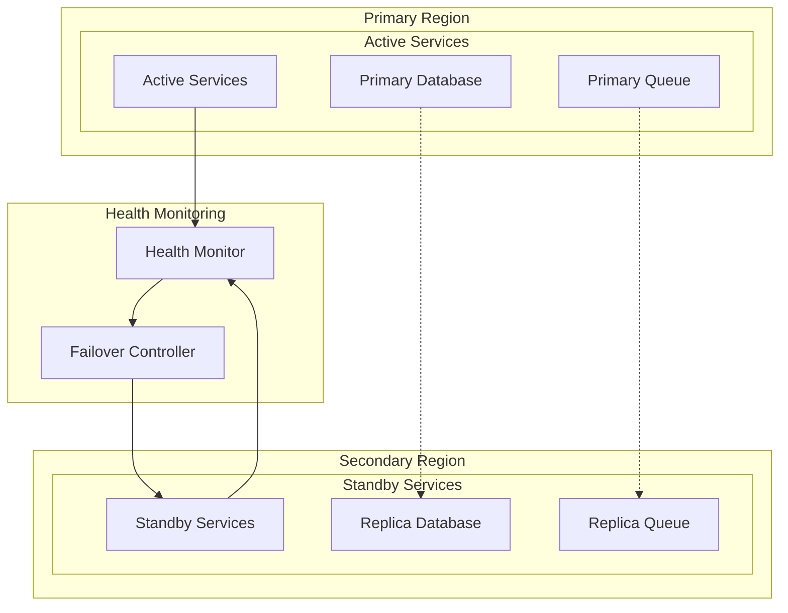
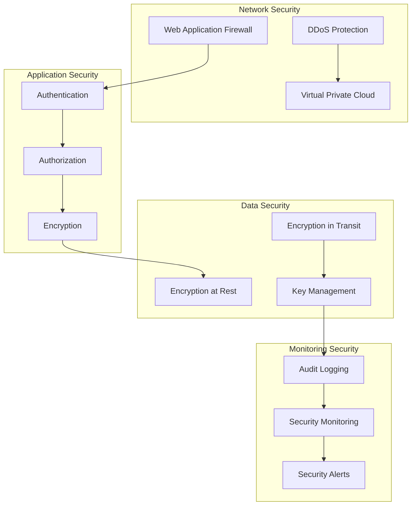
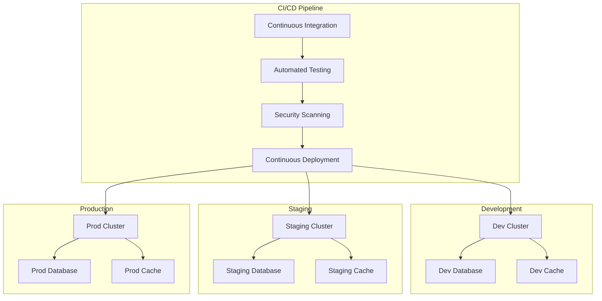

# System Overview

Xether AI is a cloud-native data processing and machine learning platform built on a microservices architecture. The system is designed for scalability, reliability, and ease of use, enabling organizations to build, deploy, and manage data pipelines and ML models at scale.

## Architecture Principles

### Cloud-Native Design
- Containerized services using Docker
- Orchestrated deployment with Kubernetes
- Horizontal scalability with auto-scaling
- Multi-region deployment capability

### Microservices Architecture
- Loosely coupled services
- Independent deployment and scaling
- Service discovery and load balancing
- Fault isolation and resilience

### Event-Driven Processing
- Asynchronous message passing
- Event sourcing for audit trails
- Real-time data streaming
- Backpressure handling

### Security First
- Zero-trust network architecture
- End-to-end encryption
- Fine-grained access control
- Comprehensive audit logging

## High-Level Architecture

## Core Components

### API Gateway
The single entry point for all client requests, handling authentication, rate limiting, request routing, and response aggregation.

**Responsibilities:**
- Request authentication and authorization
- Rate limiting and quota management
- Request routing to appropriate services
- Response caching and compression
- API versioning and backward compatibility

### Pipeline Service
Manages the creation, configuration, and orchestration of data processing pipelines.

**Responsibilities:**
- Pipeline definition and validation
- Stage composition and dependency resolution
- Scheduling and trigger management
- Pipeline versioning and lifecycle management

### Dataset Service
Handles dataset management, versioning, and metadata operations.

**Responsibilities:**
- Dataset creation and schema management
- Version control and lineage tracking
- Access control and permissions
- Data discovery and search

### Execution Service
Manages the execution of pipelines and provides monitoring capabilities.

**Responsibilities:**
- Job scheduling and resource allocation
- Execution monitoring and status tracking
- Log collection and aggregation
- Error handling and retry logic

### ML Services
Provides machine learning capabilities including outlier detection, synthetic data generation, and model management.

**Responsibilities:**
- Model training and inference
- Feature engineering and preprocessing
- Model versioning and deployment
- Performance monitoring and drift detection

## Data Flow

### Pipeline Execution Flow

### Data Ingestion Flow

## Service Interactions

### Service Dependencies

### Communication Patterns

**Synchronous Communication**
- REST API calls between services
- gRPC for high-performance internal communication
- Request-response pattern for immediate results

**Asynchronous Communication**
- Message queues for decoupled processing
- Event streaming for real-time updates
- Pub/sub pattern for broadcast notifications

**Data Access Patterns**
- Read-through/write-through caching
- Eventual consistency for distributed data
- Optimistic concurrency control for updates

## Scalability Architecture

### Horizontal Scaling

### Auto-Scaling Strategies

**Pod Auto-Scaling**
- Horizontal Pod Autoscaler (HPA) based on CPU/memory usage
- Custom metrics for queue length and request rate
- Predictive scaling based on historical patterns

**Cluster Auto-Scaling**
- Node auto-scaling based on resource utilization
- Cluster autoscaler for dynamic node provisioning
- Spot instance optimization for cost efficiency

**Database Scaling**
- Read replicas for read-heavy workloads
- Sharding for write-heavy workloads
- Connection pooling and query optimization

## High Availability Design

### Fault Tolerance

### Disaster Recovery

**Backup Strategies**
- Automated daily backups of all data
- Point-in-time recovery capability
- Cross-region backup replication
- Backup validation and restoration testing

**Recovery Procedures**
- Automated failover to secondary region
- Graceful degradation during outages
- Data consistency validation
- Service health monitoring

**RTO/RPO Targets**
- Recovery Time Objective (RTO): < 15 minutes
- Recovery Point Objective (RPO): < 5 minutes
- Service availability: 99.9% uptime
- Data durability: 99.999999999%

## Security Architecture

### Defense in Depth

### Security Controls

**Authentication & Authorization**
- OAuth 2.0 and OpenID Connect
- Role-based access control (RBAC)
- Attribute-based access control (ABAC)
- Multi-factor authentication (MFA)

**Data Protection**
- AES-256 encryption for data at rest
- TLS 1.3 for data in transit
- Customer-managed encryption keys
- Data masking and tokenization

**Network Security**
- VPC with private subnets
- Network security groups and firewalls
- DDoS protection and rate limiting
- VPN and private connectivity

**Compliance & Auditing**
- SOC 2 Type II compliance
- GDPR and CCPA compliance
- Comprehensive audit trails
- Regular security assessments

## Performance Architecture

### Performance Optimization

**Caching Strategy**
- Multi-level caching (browser, CDN, application, database)
- Cache invalidation and refresh policies
- Distributed cache with consistent hashing
- Cache warming and preloading

**Database Optimization**
- Query optimization and indexing
- Connection pooling and load balancing
- Read replicas for query distribution
- Partitioning and sharding strategies

**Network Optimization**
- Content delivery network (CDN)
- Compression and minification
- HTTP/2 and HTTP/3 support
- Geographic load balancing

### Monitoring and Observability

**Metrics Collection**
- Application performance metrics (APM)
- Infrastructure metrics (CPU, memory, network)
- Business metrics (pipeline success rate, data volume)
- Custom metrics and SLA monitoring

**Logging and Tracing**
- Structured logging with correlation IDs
- Distributed tracing across services
- Log aggregation and analysis
- Real-time log streaming and alerting

**Health Monitoring**
- Service health checks and dependency monitoring
- Synthetic transactions for end-to-end testing
- Performance baselines and anomaly detection
- Automated remediation for common issues

## Technology Stack

### Core Technologies

**Container Orchestration**
- Kubernetes for container management
- Helm for application packaging
- Istio for service mesh
- Prometheus for monitoring

**Data Storage**
- PostgreSQL for relational data
- Apache Cassandra for time-series data
- Redis for caching and session storage
- Apache Kafka for event streaming

**Machine Learning**
- TensorFlow and PyTorch for model training
- MLflow for model lifecycle management
- Apache Spark for distributed processing
- Jupyter for interactive development

**Development Tools**
- Go for high-performance services
- Python for data processing and ML
- TypeScript for web applications
- Docker for containerization

### Infrastructure Components

**Cloud Providers**
- AWS for primary deployment
- Google Cloud Platform for ML workloads
- Azure for enterprise customers
- Multi-cloud strategy for vendor diversity

**Monitoring & Observability**
- Prometheus and Grafana for metrics
- ELK Stack for logging
- Jaeger for distributed tracing
- PagerDuty for incident management

**Security Tools**
- HashiCorp Vault for secrets management
- Falco for runtime security
- OWASP ZAP for security testing
- Cloudflare for DDoS protection

## Deployment Architecture

### Environment Strategy

### Deployment Strategies

**Blue-Green Deployment**
- Zero-downtime deployments
- Instant rollback capability
- Traffic shifting between environments
- Health checks and validation

**Canary Deployment**
- Gradual traffic rollout
- Performance monitoring during rollout
- Automated rollback on issues
- A/B testing capabilities

**Feature Flags**
- Dynamic feature enablement
- Gradual feature rollout
- Emergency feature disable
- User-based targeting

## Future Architecture Evolution

### Planned Enhancements

**Edge Computing**
- Edge processing for IoT data
- Local inference for low-latency applications
- Federated learning capabilities
- Edge-to-cloud synchronization

**AI-Powered Operations**
- Intelligent auto-scaling
- Predictive maintenance
- Anomaly detection and self-healing
- Automated performance optimization

**Advanced Security**
- Zero-trust architecture implementation
- Homomorphic encryption for secure computation
- Quantum-resistant cryptography
- Advanced threat detection

**Multi-Cloud Federation**
- Cross-cloud workload orchestration
- Unified identity and access management
- Global data synchronization
- Disaster recovery across clouds

This system overview provides a comprehensive understanding of the Xether AI platform's architecture, design principles, and operational characteristics. The platform is built to scale, be secure, and provide reliable data processing and ML capabilities to organizations of all sizes.
