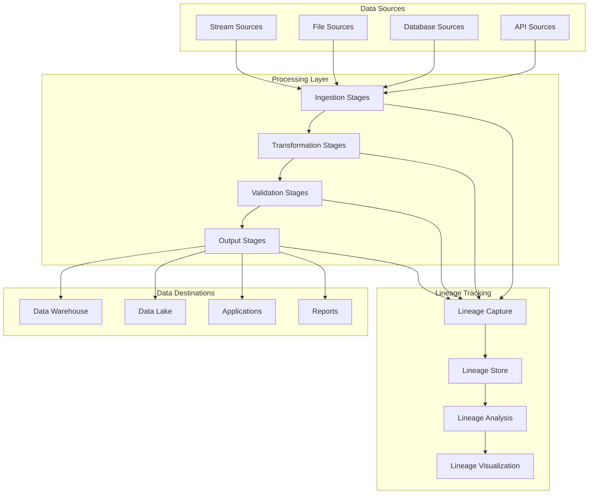

# Data Lineage

Data lineage provides complete visibility into how data flows through your organization, from source systems to final consumption. This guide covers how to track, analyze, and leverage data lineage in Xether AI.

## Lineage Overview

### What is Data Lineage?

Data lineage is the complete lifecycle of data as it moves through various systems and transformations. It answers critical questions like:
- Where did this data originate?
- What transformations were applied?
- Who accessed or modified the data?
- How did data quality change over time?

### Types of Lineage

**Technical Lineage**
- Data flow through systems and pipelines
- Transformations and schema changes
- Storage locations and formats

**Business Lineage**
- Business context and definitions
- Data ownership and stewardship
- Business rules and logic

**Operational Lineage**
- Access patterns and usage statistics
- Performance metrics and bottlenecks
- Error tracking and resolution

## Lineage Architecture

### Lineage Collection



### Lineage Components

**Lineage Nodes**
- Datasets, tables, files
- Pipeline stages and transformations
- Data quality checks
- Business rules and validations

**Lineage Edges**
- Data flow relationships
- Transformation dependencies
- Access and modification events

**Lineage Attributes**
- Schema evolution
- Data quality metrics
- Performance characteristics
- Business metadata

## Lineage Tracking

### Automatic Lineage Capture

```yaml
# Pipeline with automatic lineage tracking
name: customer-data-lineage
description: "Customer data processing with full lineage tracking"
lineage:
  enabled: true
  capture_level: "detailed"  # Options: basic, standard, detailed
  capture_metadata: true
  capture_performance: true
stages:
  - type: ingestion
    name: load-customer-data
    config:
      source: "s3://raw-data/customers/"
      format: "csv"
    lineage:
      capture_source_details: true
      capture_sample_data: true
      capture_data_quality: true

  - type: transformation
    name: transform-customer-data
    config:
      strategy: "field_mapping"
      mappings:
        customer_name: "CONCAT(first_name, ' ', last_name)"
        age_group: |
          CASE 
            WHEN age < 18 THEN 'minor'
            WHEN age < 30 THEN 'young_adult'
            WHEN age < 50 THEN 'adult'
            ELSE 'senior'
          END
    lineage:
        capture_transformations: true
        capture_field_lineage: true
        capture_expression_details: true

  - type: validation
    name: validate-customer-data
    config:
      strategy: "schema_validation"
      schema: {...}
    lineage:
        capture_validation_rules: true
        capture_validation_results: true
        capture_data_quality_metrics: true

  - type: output
    name: write-to-data-warehouse
    config:
      destination: "snowflake"
      table: "customers"
    lineage:
        capture_destination_details: true
        capture_write_statistics: true
        capture_data_volume_metrics: true
```

### Manual Lineage Annotation

```python
# Python SDK - Manual lineage annotation
import xether_ai

client = xether_ai.Client(api_key="your-api-key")

# Create lineage event
lineage_event = client.lineage.create_event({
    "dataset_id": "ds_1234567890",
    "pipeline_id": "pipe_9876543210",
    "stage_name": "data_enrichment",
    "event_type": "transformation",
    "timestamp": "2024-01-15T10:30:00Z",
    "source_datasets": ["ds_1234567890"],
    "target_datasets": ["ds_0987654321"],
    "transformation_details": {
        "type": "field_mapping",
        "mappings": {
            "customer_segment": "CASE WHEN total_orders > 50 THEN 'vip' ELSE 'regular' END"
        }
    },
    "business_context": {
        "purpose": "customer_segmentation",
        "business_rule": "vip_customer_definition",
        "owner": "marketing-team@company.com"
    },
    "data_quality": {
        "input_records": 100000,
        "output_records": 98500,
        "quality_score": 0.985,
        "validation_passed": True
    }
})
```

## Lineage Analysis

### Impact Analysis

```python
# Analyze downstream impact of dataset changes
impact_analysis = client.lineage.analyze_impact({
    "dataset_id": "ds_1234567890",
    "change_type": "schema_modification",
    "affected_fields": ["customer_id", "email"],
    "analysis_depth": "full"  # Options: immediate, full
})

print(f"Downstream datasets affected: {len(impact_analysis.affected_datasets)}")
print(f"Pipelines impacted: {len(impact_analysis.affected_pipelines)}")
print(f"Reports affected: {len(impact_analysis.affected_reports)}")

for impact in impact_analysis.affected_datasets:
    print(f"Dataset: {impact.dataset_id}")
    print(f"Impact level: {impact.impact_level}")  # critical, high, medium, low
    print(f"Estimated effort: {impact.estimated_effort_hours} hours")
```

### Root Cause Analysis

```python
# Find root cause of data quality issues
root_cause = client.lineage.find_root_cause({
    "dataset_id": "ds_1234567890",
    "issue_type": "data_quality",
    "issue_description": "High null rate in email field",
    "time_range": {
        "start": "2024-01-01T00:00:00Z",
        "end": "2024-01-15T23:59:59Z"
    },
    "analysis_depth": "deep"
})

print(f"Root cause: {root_cause.cause}")
print(f"Source stage: {root_cause.source_stage}")
print(f"Contributing factors: {root_cause.contributing_factors}")
print(f"Recommended actions: {root_cause.recommended_actions}")
```

### Data Flow Analysis

```python
# Analyze complete data flow
data_flow = client.lineage.analyze_data_flow({
    "dataset_id": "ds_1234567890",
    "include_upstream": True,
    "include_downstream": True,
    "include_transformations": True,
    "max_depth": 5
})

# Visualize data flow
for node in data_flow.nodes:
    print(f"Node: {node.name} ({node.type})")
    print(f"  Schema: {node.schema_summary}")
    print(f"  Data volume: {node.data_volume}")
    print(f"  Quality score: {node.quality_score}")

for edge in data_flow.edges:
    print(f"Edge: {edge.source} -> {edge.target}")
    print(f"  Transformation: {edge.transformation}")
    print(f"  Data volume: {edge.data_volume}")
```

## Lineage Visualization

### Graph Visualization

```python
# Generate lineage graph
lineage_graph = client.lineage.generate_graph({
    "dataset_id": "ds_1234567890",
    "graph_type": "directed",  # Options: directed, undirected, bipartite
    "layout": "hierarchical",  # Options: hierarchical, force, circular
    "include_attributes": ["schema", "quality", "volume"],
    "time_range": {
        "start": "2024-01-01T00:00:00Z",
        "end": "2024-01-31T23:59:59Z"
    }
})

# Export graph for visualization
graph_data = lineage_graph.export_format("graphml")
with open("lineage_graph.graphml", "w") as f:
    f.write(graph_data)
```

### Interactive Dashboard

```yaml
# Lineage dashboard configuration
dashboard:
  title: "Data Lineage Dashboard"
  type: "lineage"
  datasets: ["ds_1234567890"]
  time_range: "last_30_days"
  
  widgets:
    - type: "lineage_graph"
      title: "Data Flow Graph"
      config:
        layout: "hierarchical"
        node_size: "data_volume"
        node_color: "quality_score"
        edge_thickness: "data_volume"
        
    - type: "timeline"
      title: "Lineage Timeline"
      config:
        show_transformations: true
        show_quality_changes: true
        show_schema_evolution: true
        
    - type: "impact_analysis"
      title: "Change Impact"
      config:
        analysis_type: "what_if"
        scenario_modeling: true
```

## Advanced Lineage Features

### Schema Evolution Tracking

```python
# Track schema evolution over time
schema_evolution = client.lineage.get_schema_evolution({
    "dataset_id": "ds_1234567890",
    "time_range": {
        "start": "2024-01-01T00:00:00Z",
        "end": "2024-12-31T23:59:59Z"
    },
    "include_field_changes": True,
    "include_constraint_changes": True,
    "include_type_changes": True
})

for change in schema_evolution.changes:
    print(f"Version {change.from_version} -> {change.to_version}")
    print(f"Date: {change.change_date}")
    print(f"Type: {change.change_type}")  # field_added, field_removed, type_changed, constraint_added
    print(f"Field: {change.field_name}")
    print(f"Impact: {change.impact_level}")
```

### Data Quality Lineage

```python
# Track data quality through pipeline
quality_lineage = client.lineage.get_quality_lineage({
    "dataset_id": "ds_1234567890",
    "pipeline_id": "pipe_9876543210",
    "quality_metrics": [
        "completeness",
        "accuracy",
        "consistency",
        "timeliness"
    ],
    "time_range": "last_90_days"
})

for stage in quality_lineage.stages:
    print(f"Stage: {stage.stage_name}")
    for metric in stage.quality_metrics:
        print(f"  {metric.name}: {metric.value} (trend: {metric.trend})")
        
# Identify quality degradation points
degradation_points = quality_lineage.find_quality_degradation({
    "threshold": 0.05,  # 5% degradation
    "min_duration_hours": 1
})

for point in degradation_points:
    print(f"Quality degradation at {point.timestamp}")
    print(f"Stage: {point.stage_name}")
    print(f"Impact: {point.affected_downstream_count} downstream datasets")
```

### Business Rule Lineage

```python
# Track business rule evolution and impact
business_rule_lineage = client.lineage.get_business_rule_lineage({
    "dataset_id": "ds_1234567890",
    "rule_categories": ["validation", "transformation", "enrichment"],
    "include_rule_changes": True,
    "include_rule_impact": True
})

for rule in business_rule_lineage.rules:
    print(f"Rule: {rule.name}")
    print(f"Category: {rule.category}")
    print(f"Version: {rule.version}")
    print(f"Definition: {rule.definition}")
    print(f"Owner: {rule.owner}")
    print(f"Last modified: {rule.last_modified}")
    
    # Track rule effectiveness
    print(f"Effectiveness: {rule.effectiveness_score}")
    print(f"False positive rate: {rule.false_positive_rate}")
    print(f"False negative rate: {rule.false_negative_rate}")
```

## Lineage Governance

### Access Control

```yaml
# Lineage access control configuration
lineage_access:
  dataset_id: "ds_1234567890"
  
  permissions:
    read:
      roles: ["data_analyst", "data_steward", "auditor"]
      users: ["john.doe@company.com"]
    write:
      roles: ["data_steward", "data_engineer"]
      users: ["jane.smith@company.com"]
    admin:
      roles: ["data_admin"]
      users: ["admin@company.com"]
  
  field_level_access:
    pii_fields:
      roles: ["data_steward", "auditor"]
      justification_required: true
    financial_fields:
      roles: ["finance_team", "data_steward"]
      approval_workflow: true
      
  retention:
    lineage_data: "7_years"
    access_logs: "3_years"
    audit_logs: "10_years"
```

### Compliance Tracking

```python
# Track compliance through lineage
compliance_report = client.lineage.generate_compliance_report({
    "dataset_id": "ds_1234567890",
    "regulations": ["gdpr", "ccpa", "sox"],
    "time_range": "last_12_months",
    "include_data_processing": True,
    "include_access_patterns": True
})

print(f"GDPR Compliance Score: {compliance_report.gdpr.score}")
print(f"CCPA Compliance Score: {compliance_report.ccpa.score}")
print(f"SOX Compliance Score: {compliance_report.sox.score}")

for violation in compliance_report.violations:
    print(f"Violation: {violation.type}")
    print(f"Regulation: {violation.regulation}")
    print(f"Description: {violation.description}")
    print(f"Remediation: {violation.remediation_steps}")
```

## Lineage Integration

### Integration with Data Catalog

```python
# Integrate lineage with data catalog
catalog_integration = client.lineage.integrate_with_catalog({
    "dataset_id": "ds_1234567890",
    "catalog_system": "collibra",
    "sync_direction": "bidirectional",  # Options: to_catalog, from_catalog, bidirectional
    "sync_frequency": "daily",
    "field_mapping": {
        "dataset_name": "name",
        "dataset_description": "description",
        "owner": "business.owner",
        "classification": "business.classification"
    }
})

# Sync lineage information
sync_result = catalog_integration.sync()
print(f"Synced {sync_result.records_synced} lineage records")
print(f"Conflicts: {len(sync_result.conflicts)}")
```

### Integration with BI Tools

```python
# Export lineage for BI tools
bi_export = client.lineage.export_for_bi({
    "dataset_id": "ds_1234567890",
    "target_tool": "tableau",  # Options: tableau, powerbi, looker
    "export_format": "tds",  # Options: tds, pbix, lookml
    "include_data_dictionary": True,
    "include_calculated_fields": True
})

# Generate Tableau data source
tds_content = bi_export.generate_tds()
with open("customer_data.tds", "w") as f:
    f.write(tds_content)
```

## Performance Optimization

### Lineage Storage Optimization

```yaml
# Lineage storage configuration
lineage_storage:
  storage_type: "graph_database"  # Options: relational, graph_database, document_store
  
  graph_database:
    vendor: "neo4j"
    optimization:
      index_strategy: "composite"
      cache_size: "2GB"
      query_timeout: "30s"
      
  compression:
    enabled: true
    algorithm: "lz4"
    level: 6
    
  partitioning:
    strategy: "time_based"
    partition_field: "timestamp"
    partition_interval: "monthly"
    
  retention:
    raw_events: "1_year"
    processed_lineage: "7_years"
    access_logs: "3_years"
```

### Query Optimization

```python
# Optimized lineage queries
optimized_query = client.lineage.create_optimized_query({
    "query_type": "downstream_impact",
    "dataset_id": "ds_1234567890",
    "optimization_hints": {
        "use_indexes": ["dataset_id", "timestamp"],
        "limit_depth": 3,
        "cache_results": True,
        "parallel_processing": True
    }
})

# Execute optimized query
results = optimized_query.execute()
print(f"Query executed in {results.execution_time_ms}ms")
print(f"Results returned: {len(results.data)}")
```

## Best Practices

### Lineage Design

1. **Capture Early**: Start lineage capture at data ingestion
2. **Be Comprehensive**: Track all transformations and validations
3. **Maintain Context**: Preserve business and technical context
4. **Version Everything**: Track schema and rule evolution
5. **Automate Collection**: Minimize manual lineage entry

### Lineage Quality

1. **Validate Lineage**: Ensure lineage accuracy and completeness
2. **Monitor Performance**: Track lineage capture overhead
3. **Regular Audits**: Periodically validate lineage against actual data
4. **User Training**: Educate users on lineage importance
5. **Feedback Loops**: Collect and act on lineage feedback

### Governance

1. **Define Standards**: Establish lineage capture standards
2. **Access Control**: Implement appropriate access controls
3. **Compliance Tracking**: Monitor regulatory compliance
4. **Change Management**: Track all lineage changes
5. **Audit Trails**: Maintain complete audit logs

## Troubleshooting

### Common Issues

#### Missing Lineage
```python
# Diagnose missing lineage
diagnosis = client.lineage.diagnose_missing_lineage({
    "dataset_id": "ds_1234567890",
    "time_range": "last_7_days",
    "check_points": ["ingestion", "transformation", "output"]
})

for issue in diagnosis.issues:
    print(f"Issue: {issue.type}")
    print(f"Location: {issue.stage_name}")
    print(f"Resolution: {issue.resolution_steps}")
```

#### Performance Issues
```python
# Analyze lineage performance
performance_analysis = client.lineage.analyze_performance({
    "dataset_id": "ds_1234567890",
    "time_range": "last_24_hours",
    "metrics": ["capture_time", "query_time", "storage_time"]
})

for metric in performance_analysis.metrics:
    if metric.value > metric.threshold:
        print(f"Performance issue in {metric.name}: {metric.value}")
        print(f"Recommendation: {metric.optimization_recommendation}")
```

#### Data Inconsistencies
```python
# Detect data inconsistencies through lineage
inconsistency_check = client.lineage.check_data_consistency({
    "dataset_id": "ds_1234567890",
    "consistency_rules": [
        {
            "name": "schema_consistency",
            "description": "Schema should be consistent across lineage",
            "check": "compare_schemas_upstream_downstream"
        },
        {
            "name": "value_consistency",
            "description": "Values should be consistent with transformations",
            "check": "validate_transformation_results"
        }
    ]
})

for inconsistency in inconsistency_check.inconsistencies:
    print(f"Inconsistency: {inconsistency.type}")
    print(f"Impact: {inconsistency.impact_level}")
    print(f"Resolution: {inconsistency.resolution_steps}")
```

This comprehensive lineage guide provides everything needed to implement and manage data lineage in Xether AI, from basic concepts to advanced governance and optimization techniques.
